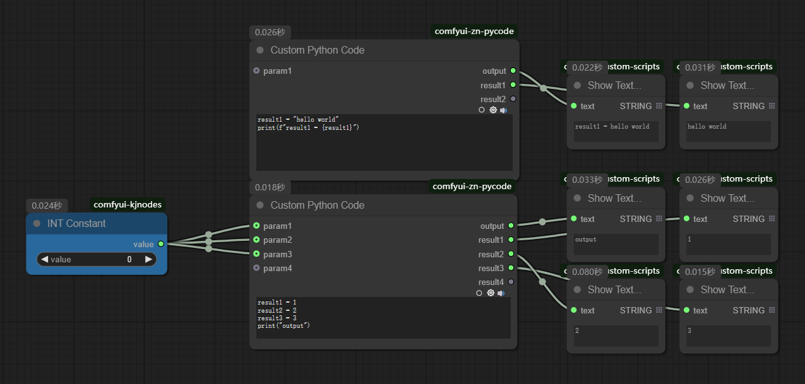

# comfyui-zn-pycode
自定义ComfyUI节点，用于执行自定义Python代码来进行灵活的数据处理，最大可支持20个输入参数和输出结果，并且会根据参数和结果使用情况自动对不使用的插槽进行显隐。  
A custom ComfyUI node for running your own Python code to handle data flexibly. It supports up to 20 input parameters and 20 output results, and will automatically show or hide unused slots based on whether the parameters and results are being used.

# Installation
克隆或下载仓库并将comfyui-zn-pycode文件夹放入ComfyUI/custom_nodes文件夹中  
Clone or download the repository and place the comfyui-zn-pycode folder into the ComfyUI/custom_nodes folder  

# Usage
* 输入插槽 param1 ~ param20 支持连接任意类型，只显示下一个未使用的插槽，其余插槽自动隐藏
* 输入属性 code 多行编辑控件，用于编辑自定义Python代码，可在代码中直接读取输入插槽param1 ~ param20的值，和修改输出插槽result1 ~ result20的值
* 输出插槽 output 输出标准流内容方便测试
* 输出插槽 result1 ~ result20 支持返回任意类型数据，只显示下一个未使用的插槽，其余插槽自动隐藏
* Input slots param1 ~ param20 support connection of any type. Only the next unused slot is displayed, and the remaining slots are automatically hidden
* Input attribute code multi-line editing control, used for editing custom Python code, which can directly read the values of input slots param1 ~ param20 and modify the values of output slots result1 ~ result20 in the code
* The output slot "output" facilitates testing by outputting standard stream content
* Output slots result1 ~ result20 support returning any type of data. Only the next unused slot is displayed, and the remaining slots are automatically hidden
    

